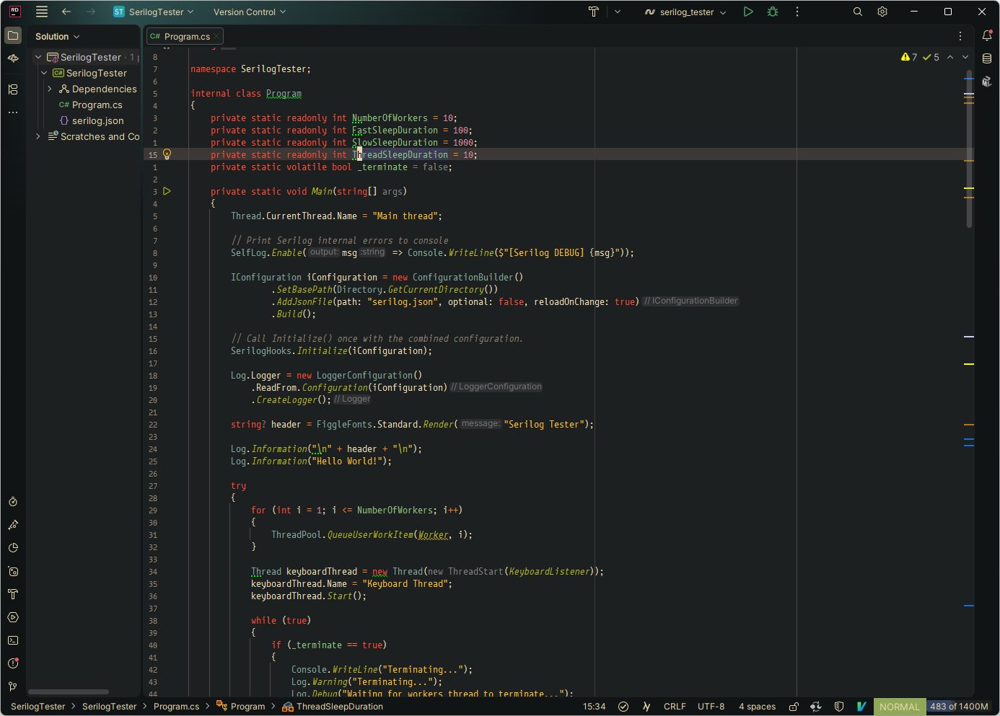
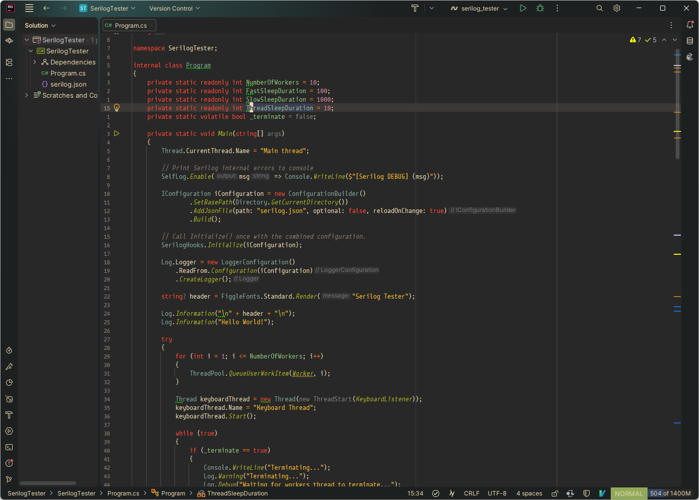
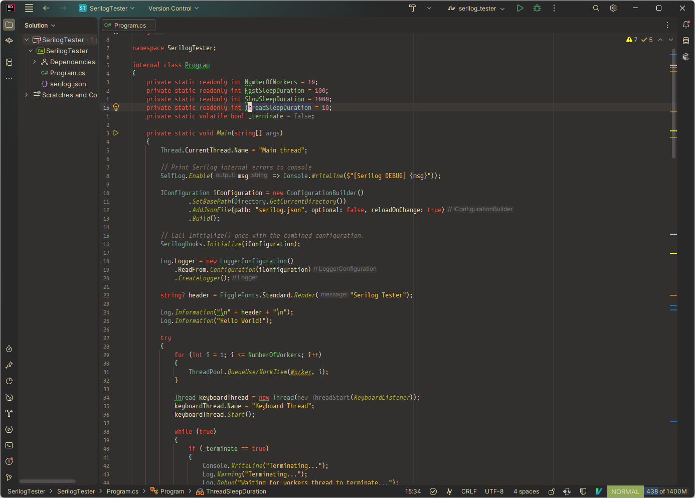
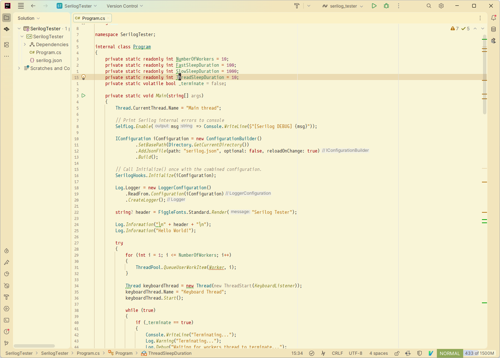
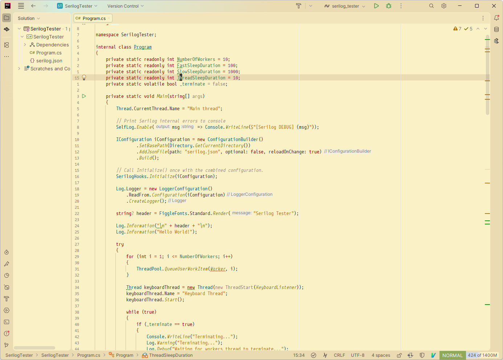
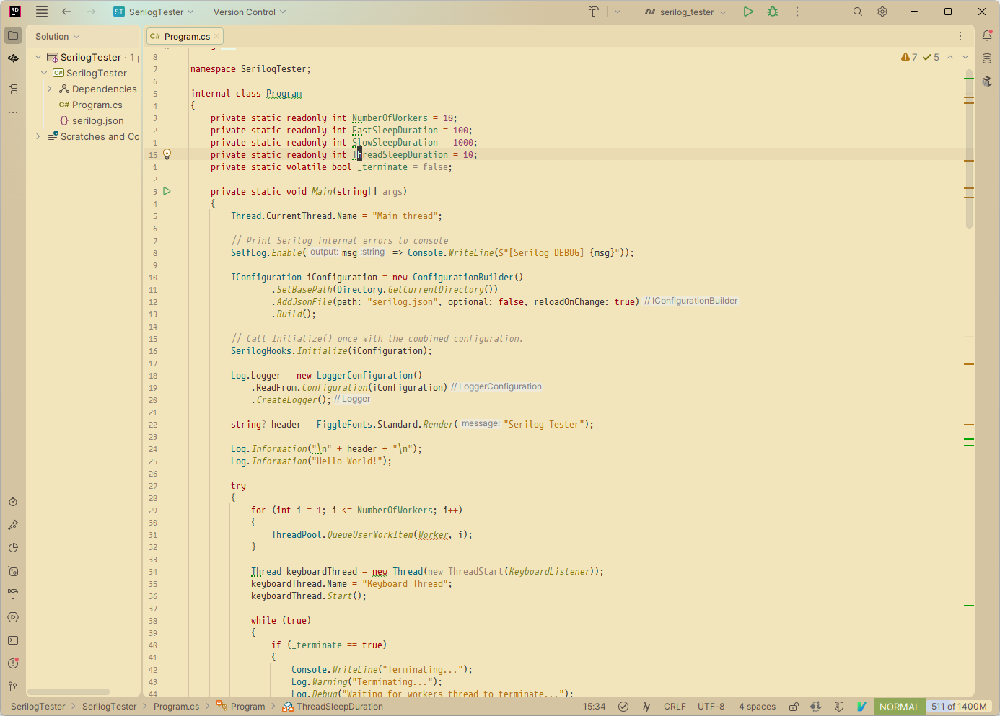

# Gruvbox Islands
<!-- Plugin description -->
## Description

**Gruvbox Islands** brings the warm, retro-groove of the **Gruvbox** color palette to
IntelliJ-based IDEs, reimagined for the modern **Islands (New UI)** aesthetic.

Unlike a single dark/light pair, this plugin ships the full Gruvbox contrast matrix:
**dark** and **light**, each in **hard**, **medium** and **soft**.

### Variants

| Theme | Editor background | Window chrome | Image
| :--- | :--- | :--- | :--- |
| **Gruvbox Dark Hard Islands** | `#1d2021` | `#101415` |  
| **Gruvbox Dark Medium Islands** | `#282828` | `#1d2021` |  
| **Gruvbox Dark Soft Islands** | `#32302f` | `#282828` | 
| **Gruvbox Light Hard Islands** | `#f9f5d7` | `#f2e5bc` |  
| **Gruvbox Light Medium Islands** | `#fbf1c7` | `#ebdbb2` |  
| **Gruvbox Light Soft Islands** | `#f2e5bc` | `#d5c4a1` | 

As in upstream Gruvbox, hard / medium / soft differ only in the background ladder —
foreground, accent and syntax colors are identical across the three.

### Features

#### Designed for the "Islands" UI
Every variant is registered with `targetUi="islands"`, so toolbars, project trees and
editor tabs blend seamlessly with the Gruvbox palette. The Islands UI layers a darker
window chrome behind lighter island panels; all three background tiers shift together
per variant so that layering stays visible in hard and soft as well as medium.

#### Enhanced Syntax Highlighting
Each variant ships a dedicated editor scheme applying Gruvbox colors to your code,
supporting a wide range of languages including Java, Kotlin, Python, JavaScript,
Rust, Go, and more.

#### Gruvbox-tinted controls
Checkboxes and radio buttons are recolored to the Gruvbox palette rather than the
stock JetBrains blue.

---
<!-- Plugin description end -->

### Installation

1. Open **Settings/Preferences** in your IDE.
2. Navigate to **Plugins** > **Marketplace**.
3. Search for **"Gruvbox Islands"**.
4. Click **Install** and restart your IDE.
5. Go to **Appearance & Behavior** > **Appearance** and pick one of the six
   **Gruvbox ... Islands** entries from the Theme dropdown.

### Building locally

```
./gradlew buildPlugin
```

### Acknowledgments

Structure and Islands-UI tuning are based on
[Gruvbox Islands Theme](https://github.com/nowheremat/gruvbox-island-theme) by Nowheremat,
which in turn builds on the
[Armada Core Themes](https://plugins.jetbrains.com/plugin/26844-armada-core-themes) plugin.

The hard/medium/soft palette matrix follows
[gruvbox-intellij-theme](https://github.com/lonre/gruvbox-intellij-theme) by Lonre Wang
and Vincent Parizet.

And naturally thanks to morhetz for the original [Gruvbox](https://github.com/morhetz/gruvbox).

***This plugin is not affiliated with or endorsed by JetBrains.***
